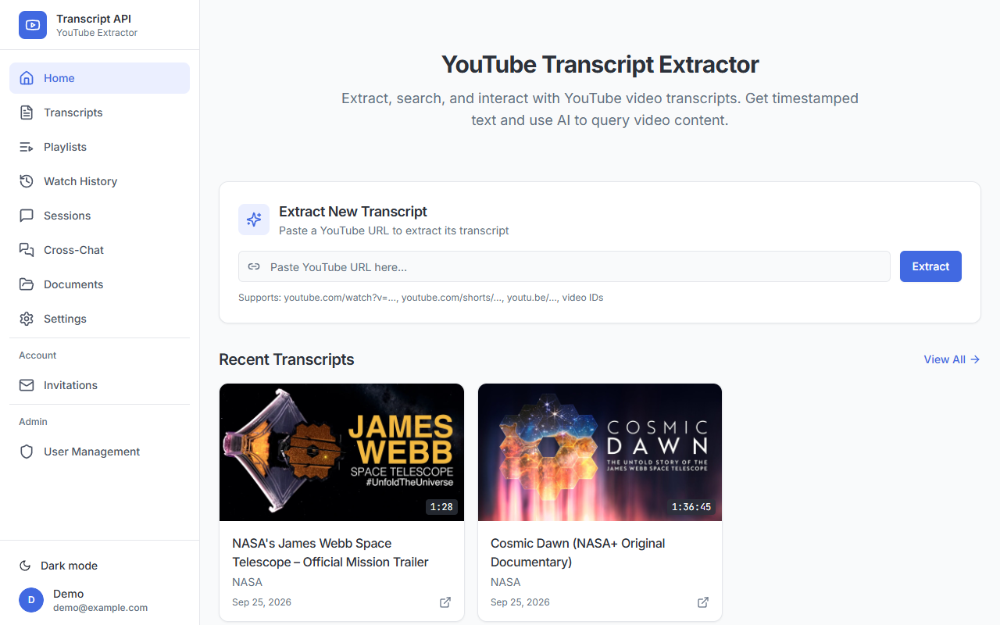
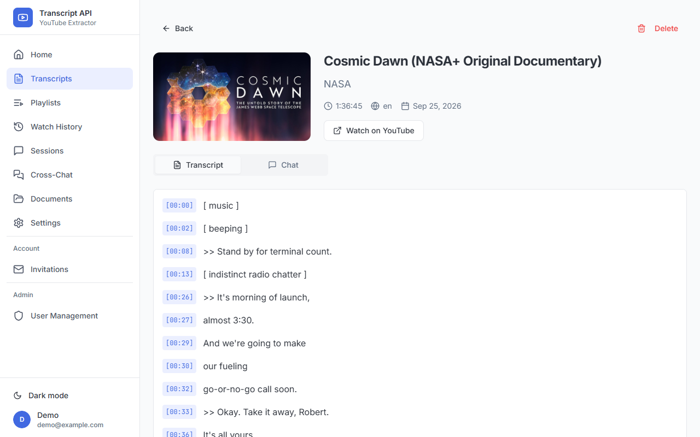

# Boxless Reel

[](https://github.com/BoxlessMinds/boxless-reel/actions/workflows/ci.yml)
[](LICENSE)

**Boxless Reel turns YouTube videos into a searchable library of transcripts you can read, search and ask questions about, on your own computer.**

## What it is and who it's for

Videos are slow to search. If you remember that someone explained something in a two-hour talk, finding the exact minute means scrubbing through it. Boxless Reel saves the transcript (the written text of what's said) of any YouTube video you give it, keeps it in a library on your machine, and lets you ask questions about it. Answers come with timestamps that link back to the moment in the video.

It's a self-hosted web app: you run it yourself, and your library stays in a database on your own machine. It's for people who learn from long-form video, for example:

- **Students and researchers** who want to quote a lecture or talk accurately, with the timestamp.
- **Anyone who watches a lot of tutorials** and wants to ask "where did they explain X?" across several videos at once.
- **People with large YouTube playlists** who want to tidy them up: remove duplicates, remove videos that were deleted or made private, or remove videos they've already watched.

What it can do:

- **Save transcripts** from a YouTube link, with the title, channel and timestamps.
- **Chat with a transcript** (or several at once) using an AI model from Anthropic (Claude) or OpenAI (GPT). You can add your own PDF, Word or text files to the conversation, and optionally let it search the web.
- **Manage your YouTube playlists** by connecting your own Google account. Every change is shown to you as a plan first, and nothing happens until you approve it.
- **Share it with a few people.** It has user accounts, an admin role and invitation codes.

What it does **not** do:

- **It isn't a hosted service.** There's no website to sign up to; you run your own copy.
- **It doesn't download videos.** It saves text, not video files.
- **The AI features aren't free.** Chat needs your own API key from Anthropic or OpenAI, and those providers charge per use. You'll also want an OpenAI key just to save transcripts smoothly: each saved transcript is indexed for search using OpenAI, and without a key, the transcript is still saved, but the app currently freezes for several minutes afterwards.
- **It can't get transcripts that don't exist.** If a video has no captions, it can optionally transcribe the audio with OpenAI's Whisper service (again, with your own key). Otherwise it reports that no transcript is available.
- **It doesn't get around YouTube's limits** (rate limits, blocked regions, private videos), and never will. See [CONTRIBUTING.md](CONTRIBUTING.md) for what's in scope.

## Screenshots

Paste a YouTube link to save its transcript. Your library appears underneath.



Read a transcript with timestamps, or switch to the Chat tab to ask questions about it.



## Quick start (Docker)

Docker is the quickest way to try Boxless Reel: one command builds and starts both the API (the server that does the work) and the web interface. It takes about 10 minutes the first time, mostly waiting for the build.

**You'll need** [Git](https://git-scm.com/downloads) and [Docker Desktop](https://docs.docker.com/get-docker/) (or Docker Engine with the Compose plugin). Start Docker, then check both are installed:

```bash
git --version
docker compose version
```

You should see a version number from each, for example `git version 2.45.0` and `Docker Compose version v2.29.0`. Any recent version works.

The commands below work as written in macOS and Linux terminals, and in Git Bash on Windows. Where Windows PowerShell needs something different, it's shown underneath.

**1. Download the code.**

```bash
git clone https://github.com/BoxlessMinds/boxless-reel.git
cd boxless-reel
```

You should see `Cloning into 'boxless-reel'...` followed by `done`. You're now inside the project folder; run the remaining commands from here.

**2. Create your settings file.** Docker reads its settings from a file called `.env.docker`. Start from the example:

```bash
cp .env.example .env.docker
```

This prints nothing. You now have a `.env.docker` file next to `.env.example`.

**3. Generate a login secret.** The app signs people's logins with a secret key, and it won't start without one. Generate a random one:

```bash
openssl rand -hex 32
```

You should see a line of 64 letters and numbers. If `openssl` isn't installed (common on Windows), run this in PowerShell instead:

```powershell
-join ((1..32) | ForEach-Object { '{0:x2}' -f (Get-Random -Maximum 256) })
```

**4. Edit `.env.docker`** in any text editor, and set these values:

```ini
# Paste the value from step 3
JWT_SECRET_KEY=paste-your-64-character-value-here

# Lets the web interface (on port 8050) talk to the API
ALLOWED_ORIGINS=["http://localhost:8050"]
FRONTEND_URL=http://localhost:8050

# Recommended: OpenAI is used to index transcripts for search, and either key enables AI chat
OPENAI_API_KEY=
ANTHROPIC_API_KEY=
```

`JWT_SECRET_KEY` and the two API keys already exist in the file; fill them in where they are. Add `ALLOWED_ORIGINS` and `FRONTEND_URL` at the end. Keep this file private: it holds your secrets, and Git is already set up to ignore it.

**5. Create an empty database file.** Docker stores your library in a file called `transcripts.db` in this folder. It must exist before the first start, or Docker creates a folder with that name instead and the app can't open its database.

```bash
touch transcripts.db
```

In PowerShell, use `New-Item transcripts.db -ItemType File` instead. Either way it prints nothing (PowerShell prints a one-line file listing).

**6. Build and start the app.**

```bash
docker compose up -d --build
```

The first build downloads and installs everything, so it takes several minutes. It finishes with lines like these:

```text
 ✔ Container boxless-api       Healthy
 ✔ Container boxless-frontend  Started
```

**7. Check the API is running.**

```bash
curl http://localhost:5050/health
```

You should see `{"status":"healthy"}`.

**8. Create your admin account.** There's no default login. Create the first account, which is the admin, from the command line (use your own email address):

```bash
docker compose exec api python -m src.cli create-admin --email you@example.com
```

It asks for a password twice (at least 8 characters; nothing shows as you type), then prints `Admin user created successfully!`.

**9. Open the app.** Go to <http://localhost:8050> in your browser and sign in with the account you just made.

| What | Address |
|---|---|
| Web interface | <http://localhost:8050> |
| API | <http://localhost:5050> |
| Interactive API docs | <http://localhost:5050/docs> |

These addresses only work from your own computer; the app isn't exposed to your network.

**To stop the app**, run `docker compose down`. Your library is kept in `transcripts.db` and the `data` folder, and comes back next time you run `docker compose up -d`.

**If something goes wrong**, `docker compose logs api` shows the API's messages. The most common problems:

- *The API keeps restarting and the log mentions `JWT_SECRET_KEY`*: the secret from step 3 is missing or shorter than 32 characters.
- *The page loads but signing in fails with a network error*: `ALLOWED_ORIGINS` in step 4 is missing. Fix it, then run `docker compose up -d` again.
- *The log says `unable to open database file`*: `transcripts.db` didn't exist before the first start, so Docker made a folder with that name. Run `docker compose down`, delete the `transcripts.db` folder, then repeat steps 5 and 6.

## Manual setup

Use this if you want to change the code, or you'd rather not use Docker. You'll run two things side by side: the API in one terminal and the web interface in another.

### Prerequisites

| Tool | Version | Check with | You should see |
|---|---|---|---|
| [Git](https://git-scm.com/downloads) | any recent | `git --version` | `git version 2.x` |
| [Python](https://www.python.org/downloads/) | 3.11 or newer | `python --version` (or `python3 --version`) | `Python 3.11.x` or higher |
| [uv](https://docs.astral.sh/uv/getting-started/installation/) | any recent | `uv --version` | `uv 0.x.y` |
| [Node.js](https://nodejs.org/) and npm | Node 20 or newer | `node --version` | `v20.x` or higher |

uv is the Python package manager this project uses for everything. Please use it rather than `pip`. If you don't have Python 3.11 installed, uv can download it for you when you run `uv sync`.

Optional: [ffmpeg](https://ffmpeg.org/download.html), only if you want the Whisper fallback to transcribe videos without captions.

### Start the API

**1. Download the code** (skip this if you already did it for Docker).

```bash
git clone https://github.com/BoxlessMinds/boxless-reel.git
cd boxless-reel
```

**2. Install the Python dependencies.**

```bash
uv sync
```

The first run takes a minute or two and ends with a line like `Installed 101 packages`. It creates a `.venv` folder that holds them.

**3. Create your settings file.** Outside Docker, the app reads `.env`:

```bash
cp .env.example .env
```

**4. Set a login secret.** Generate one with uv, which works the same on every system:

```bash
uv run python -c "import secrets; print(secrets.token_hex(32))"
```

Open `.env`, and paste the 64-character value after `JWT_SECRET_KEY=`. Add your `OPENAI_API_KEY` too (see [Configuration](#configuration) for why), and `ANTHROPIC_API_KEY` if you want to chat using Claude. You don't need to change anything else to get started.

**5. Start the API** on port 8001, which is the port the web interface expects:

```bash
uv run uvicorn src.main:app --reload --port 8001
```

You should see `Uvicorn running on http://127.0.0.1:8001` and, a moment later, `Application startup complete.` Leave this terminal open; `--reload` restarts the server whenever you change the code.

**6. Check it's running.** In a second terminal:

```bash
curl http://localhost:8001/health
```

You should see `{"status":"healthy"}`. The interactive API docs are at <http://localhost:8001/docs>.

**7. Create your admin account.** In the second terminal, from the `boxless-reel` folder:

```bash
uv run python -m src.cli create-admin --email you@example.com
```

Enter a password twice (at least 8 characters). You should see `Admin user created successfully!`.

### Start the web interface

**1. Go to the web interface folder and install its dependencies.**

```bash
cd youtube-transcript-ui
npm install
```

This takes a minute and ends with a line like `added 558 packages`. Warnings about deprecated packages are normal.

**2. Tell the web interface where the API is.** Create a file called `.env.local` in the `youtube-transcript-ui` folder containing this one line:

```ini
VITE_API_URL=http://127.0.0.1:8001
```

Some parts of the interface (document uploads and watch-history import) look for the API on a different port unless this is set.

**3. Start the development server.**

```bash
npm run dev
```

You should see `VITE ... ready` and a line with `Local: http://localhost:8080/`. Open <http://localhost:8080> and sign in with the admin account you created.

To stop either server, press `Ctrl+C` in its terminal.

## Configuration

All settings are environment variables, read from `.env` (manual setup) or `.env.docker` (Docker). The table below covers the ones most people need. [`.env.example`](.env.example) lists many more, such as chunk sizes and Whisper options, each with a comment explaining it.

| Setting | Required? | What it does |
|---|---|---|
| `JWT_SECRET_KEY` | **Yes** | Secret used to sign logins (JWT stands for JSON Web Token, the kind of login token the app uses). At least 32 characters. The API refuses to start without it. |
| `ANTHROPIC_API_KEY` | For AI chat | Your key from [Anthropic](https://console.anthropic.com/settings/keys), to chat using Claude. |
| `OPENAI_API_KEY` | For AI chat | Your key from [OpenAI](https://platform.openai.com/api-keys), to chat using GPT. It's also used to index every saved transcript for search, and for the Whisper fallback, so set it even if you chat with Claude. Without it, the app currently freezes for several minutes each time you save a transcript. |
| `DEFAULT_LLM_PROVIDER` | No | Which AI provider to use by default: `anthropic` or `openai`. |
| `ALLOWED_ORIGINS` | For Docker | Web addresses allowed to call the API, as a list, for example `["http://localhost:8050"]`. The default allows the manual-setup web interface on port 8080. |
| `FRONTEND_URL` | For Docker | The web interface's address. Used in invitation links and after connecting a YouTube account. Defaults to `http://localhost:8080`. |
| `REQUIRE_INVITATION_CODE` | No | `true` means people need an invitation to sign up; `false` means anyone who can reach the app can register. The example file sets `false`. An admin can change this later in the app. |
| `SETTINGS_ENCRYPTION_KEY` | Recommended | Key used to encrypt API keys that users save in the app's Settings page. If you don't set it, a new one is made at every start, and saved keys stop working after a restart. Generate one with `uv run python -c "from cryptography.fernet import Fernet; print(Fernet.generate_key().decode())"`. |
| `TAVILY_API_KEY` | No | Key from [Tavily](https://tavily.com/), to let chat search the web. |
| `GOOGLE_OAUTH_CLIENT_ID`, `GOOGLE_OAUTH_CLIENT_SECRET` | For playlists | Credentials that let users connect their YouTube account. See below. |
| `GOOGLE_OAUTH_REDIRECT_URI` | For playlists | Where Google sends users back after they connect. Defaults to `http://localhost:8001/api/youtube-auth/callback`; for Docker, use `http://localhost:5050/api/youtube-auth/callback`. |

### Setting up playlist management (optional)

Playlist features use the YouTube Data API through OAuth (the standard "Sign in with Google" permission screen). You create the credentials once, in your own Google Cloud account:

1. In the [Google Cloud Console](https://console.cloud.google.com/), create a project and enable the **YouTube Data API v3**.
2. Create an **OAuth client ID** of type **Web application**.
3. Add an authorised redirect URI that exactly matches your `GOOGLE_OAUTH_REDIRECT_URI` (see the table above).
4. Copy the client ID and secret into `GOOGLE_OAUTH_CLIENT_ID` and `GOOGLE_OAUTH_CLIENT_SECRET`, then restart the API.

Google gives each project a daily allowance of 10,000 API units. Boxless Reel tracks it and shows the cost of every playlist change before you apply it.

## Using the API

Everything the web interface does goes through a REST API (a set of web addresses that other programs can call), so you can script it too. The API documents itself: open `/docs` on your running server, <http://localhost:5050/docs> with Docker or <http://localhost:8001/docs> with manual setup, to see every endpoint and try it from your browser.

Most endpoints need you to be signed in. Call `POST /api/auth/login` with your email and password, then send the returned access token in an `Authorization: Bearer <token>` header.

The main groups are:

| Group | What it covers |
|---|---|
| `/api/transcripts` | Save, list, read and delete transcripts |
| `/api/sessions`, `/api/cross-chat` | AI chat about one transcript, or several at once |
| `/api/documents` | Files added to chats |
| `/api/playlists`, `/api/plans` | YouTube playlist sync, and plans for changing playlists |
| `/api/auth`, `/api/invitations`, `/api/admin` | Accounts, invitations and administration |

The [`postman`](postman) folder has a ready-made collection for [Postman](https://www.postman.com/), an app for sending API requests by hand.

## Contributing

Contributions are welcome, from typo fixes to new features.

- [CONTRIBUTING.md](CONTRIBUTING.md) explains how to set up for development, run the tests and open a pull request.
- [CODE_OF_CONDUCT.md](CODE_OF_CONDUCT.md) sets out how we treat each other.
- [SECURITY.md](SECURITY.md) explains how to report a security problem privately. Please don't use public issues for those.
- [CHANGELOG.md](CHANGELOG.md) lists what has changed in each release.

## Licence

Boxless Reel is released under the [MIT License](LICENSE).

Boxless Reel is an independent project. It is not affiliated with, endorsed by or sponsored by YouTube or Google. YouTube is a trademark of Google LLC. When you use Boxless Reel, you're responsible for following [YouTube's Terms of Service](https://www.youtube.com/t/terms).
